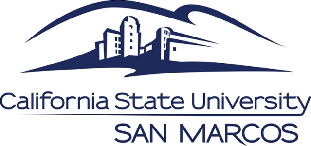

# CS433 Operating Systems - Programming Projects

## Overview
This repository contains programming assignments for CS433 Operating Systems course at California State University San Marcos. Each project implements fundamental operating system concepts, providing hands-on experience with process management, scheduling algorithms, synchronization, memory management, and more.

## Project Descriptions

### Program 1: Process Control Block and Ready Queue Implementation
**Implementation Details:**
- Designed and implemented a Process Control Block (PCB) class to represent essential process information including process ID, priority, and state
- Developed a priority-based ReadyQueue using a max heap data structure for efficient process scheduling
- Implemented core operations: enqueue, dequeue, and priority management
- Used object-oriented design principles with proper encapsulation and memory management

**Concepts Learned:**
- Process states and transitions in operating systems
- Priority-based process scheduling mechanisms
- Heap data structures for efficient priority queue implementation
- Memory management in C++ (dynamic allocation, copy constructors, destructors)

### Program 2: Simple UNIX Shell
**Implementation Details:**
- Developed a command-line interface that mimics basic UNIX shell functionality
- Implemented command parsing and execution using fork() and exec() system calls
- Added support for command history, background processes, and signal handling
- Implemented I/O redirection and pipe functionality for command chaining

**Concepts Learned:**
- Process creation and management using fork() and exec()
- Parent-child process relationships and zombie process prevention
- Signal handling in UNIX environments
- File descriptor manipulation for I/O redirection
- Inter-process communication using pipes

### Program 3: CPU Scheduling Algorithms
**Implementation Details:**
- Implemented multiple CPU scheduling algorithms through inheritance from a base Scheduler class
- Algorithms include First-Come-First-Served (FCFS), Shortest Job First (SJF), Priority, and Round Robin
- Designed a simulation framework to compare performance metrics across different algorithms
- Collected and analyzed statistics including average waiting time, turnaround time, and CPU utilization

**Concepts Learned:**
- CPU scheduling algorithms and their performance characteristics
- Object-oriented design using inheritance and polymorphism
- Performance analysis and algorithm comparison methodologies
- Trade-offs between fairness, throughput, and response time in scheduling

### Program 4: Multi-threaded Producer-Consumer Problem
**Implementation Details:**
- Implemented a solution to the classic producer-consumer synchronization problem
- Used POSIX threads (pthreads) for concurrent execution of producer and consumer processes
- Implemented synchronization using mutex locks and semaphores to prevent race conditions
- Created a circular buffer for efficient item storage and retrieval

**Concepts Learned:**
- Thread creation and management in multi-threaded environments
- Synchronization primitives: mutex locks and semaphores
- Critical section protection and deadlock prevention
- Bounded buffer implementation and management
- Race condition identification and prevention

### Program 5: Page Replacement Algorithms
**Implementation Details:**
- Developed a virtual memory simulation framework to evaluate page replacement algorithms
- Implemented and compared three page replacement strategies:
  - FIFO (First-In-First-Out)
  - LIFO (Last-In-First-Out)
  - LRU (Least Recently Used)
- Created a page table structure to track page-to-frame mappings
- Measured and analyzed performance metrics including page fault rates and execution time

**Concepts Learned:**
- Virtual memory concepts and page replacement policies
- Memory address translation and page table management
- Performance analysis of different page replacement algorithms
- Trade-offs between implementation complexity and performance
- Simulation techniques for memory management evaluation

## Technologies and Tools
- C++ programming language
- POSIX threads and synchronization primitives
- UNIX system calls and process management
- Data structures for efficient algorithm implementation
- Performance measurement and analysis techniques

## Academic Context
These projects were completed as part of the CS433 Operating Systems course at California State University San Marcos under the instruction of Dr. Zhang. The implementations demonstrate both theoretical understanding and practical application of core operating system concepts.
